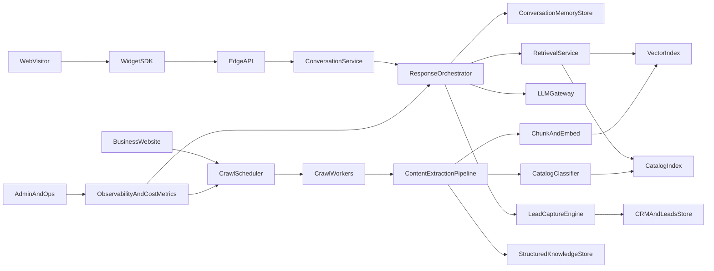

# AI Sales Agent Venture-Scale System Design

## 1) Product Goals And Non-Negotiables

- Build a multi-tenant AI sales agent that works across industries with minimal per-tenant setup.
- Ensure responses are intelligent (LLM-native), grounded in business website data, and behaviorally human-like.
- Support very large tenant and traffic scale with predictable cost and low latency.
- Avoid hallucination and product spam while still handling unknown questions gracefully.

Primary constraints:

- Multi-language readiness from first message.
- Token efficiency at inference time.
- Safe defaults for unknown/low-confidence situations.
- Clean separation between ingestion/training and real-time inference.

## 2) High-Level Architecture

Core services:

- Ingestion plane: crawl, parse, normalize, classify, summarize, embed, index.
- Serving plane: real-time orchestration with retrieval, memory, lead logic, and LLM response.
- Control plane: tenant config, quotas, SLAs, policy, experiments, analytics.

## 3) Tenant Data Model (Canonical)

- Tenant: business identity + domains + language profile + policy.
- WebsiteAsset: pages, sections, nav graph, products/catalog metadata, FAQ fragments.
- KnowledgeUnits:
  - `atomic_chunks` (small, citation-friendly)
  - `section_summaries` (mid-level)
  - `site_digest` (global compressed overview)
- CatalogEntities: products/services with structured attributes (name, category, price/range, availability, url, confidence).
- ConversationState: session turns + rolling summary + intent trajectory + lead stage.
- LeadRecord: structured captured signals (name/email/phone/company/need/timeline/budget + consent state).

## 4) Website Crawling Strategy

### 4.1 Crawl Entry And Discovery

- Inputs: root URL + optional sitemap URLs + robots policy.
- Discovery order:
  - Parse sitemap(s) first for coverage and priority.
  - Crawl internal links BFS with depth caps and per-domain concurrency limits.
  - Extract navigation clusters (header/footer/menu breadcrumbs) to infer site structure.
- Respect canonical links, hreflang variants, noindex/nofollow, robots.txt.

### 4.2 Crawl Modes

- Initial full crawl: breadth-focused for first onboarding.
- Incremental crawl: frequent recrawl of high-change pages (pricing, product, blog latest).
- Triggered crawl: manual retrain or webhook-initiated (CMS publish event).

### 4.3 Rendering And Reliability

- Tiered fetcher:
  - Tier 1: fast HTTP fetch + readability extraction.
  - Tier 2: JS-rendered headless browser only when needed.
- Anti-duplication:
  - URL normalization + content hashing (simhash/minhash) to skip near-duplicate pages.
- Backoff and retry by error class (timeout, 5xx, blocked pages).

### 4.4 Crawl Guardrails For Scale

- Global worker pools + per-tenant quota buckets.
- Crawl budget per tenant (pages/day, render minutes/day).
- Priority queue by tenant plan tier + freshness score + content change likelihood.

## 5) Content Extraction Strategy

### 5.1 Structured Extraction Pipeline

- Page cleanup: remove boilerplate, nav noise, cookie banners, scripts.
- Segment content into semantic blocks:
  - hero/value prop
  - product/service sections
  - pricing tables
  - policies/shipping/returns
  - testimonials/case studies
  - contact/locations/hours
- Build internal link graph and parent-child topic hierarchy.

### 5.2 Product Catalog Detection

- Catalog signals:
  - repetitive item templates, grid/list structures, SKU/price patterns, filter/sort UI traces.
- Classify page as one of:
  - catalog index
  - product detail
  - general marketing page
  - support/documentation
- Extract product entities only if confidence > threshold.
- Maintain category-level aggregates to avoid listing random items.

## 6) Summarization And Compression Strategy

### 6.1 Multi-Resolution Knowledge Compression

Create 3 levels per tenant:

- L0 `atomic_chunks` (300-700 tokens equivalent text spans; citation-ready).
- L1 `section_summaries` (per page/section distilled facts).
- L2 `site_digest` (global business summary with key offerings, differentiators, policies).

### 6.2 Distillation Rules

- Preserve factual claims, remove repetitive marketing language.
- Normalize units/currency/date formats.
- Keep source URL references for each distilled fact.
- Track confidence and freshness timestamp per fact.

### 6.3 Prompt Payload Assembly

- Always retrieve smallest sufficient context first:
  - Start with L2 + top L1 snippets.
  - Add L0 only when question requires specifics.
- Hard token budget envelopes by plan tier and model.

## 7) Prompt Overload Prevention

- Use an orchestrator pipeline, not one giant prompt.
- Pipeline order:
  1. intent classification
  2. retrieval planning
  3. evidence selection
  4. response generation with strict context budget
  5. post-check for repetition/verbosity/language compliance
- Apply context packing heuristics:
  - deduplicate semantically similar chunks
  - prefer chunks with stronger source confidence
  - prefer recent pages when conflict exists
- Use short system policy + compact tool outputs instead of verbose instructions every turn.

## 8) Handling Large Catalogs Without Random Listing

- Do not dump product lists by default.
- Catalog response policy:
  - If catalog size > threshold, ask clarifying question first (budget/type/use-case).
  - Return category-level options with 2-5 representative items max.
  - Offer guided narrowing filters (price range, feature, use case).
- Build `CatalogPlanner` step:
  - Query-time facet extraction from user request.
  - Retrieve matching category and top candidates by relevance score.
- Use “compare” mode when user asks for alternatives; cap comparisons to manageable set.

## 9) Language Detection And First Message

### 9.1 Language Detection

- Detect language using combined signals:
  - page/site language (`html lang`, hreflang, dominant text language)
  - visitor browser language (`navigator.language`)
  - first user utterance language classifier
- Maintain `sessionLanguage` with confidence and allow instant override when user switches language.

### 9.2 First Message Behavior

- First message generated at chat open (before user types), localized to `sessionLanguage`.
- Message template logic:
  - greeting + business-aware value proposition + 1 helpful suggestion question.
- Keep first message short (1-2 lines) to reduce noise and improve engagement.

## 10) Conversation Memory Strategy

- Memory layers:
  - Turn memory: last N turns for local coherence.
  - Session summary: compressed running summary every few turns.
  - Long-term visitor memory: preference and lead facts across sessions (with TTL and consent).
- Anti-repetition mechanism:
  - Maintain “already shared facts” set per session.
  - Penalize repeated semantic content in response post-check.
- Adaptive response length policy:
  - infer desired depth from user question complexity and prior behavior.
  - short answers for direct questions; expanded answers for exploratory asks.

## 11) Lead Capture Logic (Natural, Non-Robotic)

- Lead scoring in conversation state (intent + urgency + qualification signals).
- Progressive profiling sequence:
  - capture one field at a time only when contextually natural.
  - ask permission before collecting sensitive details.
- Triggers:
  - explicit buying intent (“price”, “demo”, “quote”, “book call”).
  - high-confidence problem-solution fit.
- Conversation style:
  - helpful first, qualification second.
  - fallback phrasing for low-confidence asks (“I can connect you with the team if helpful”).
- Store partial leads, not all-or-nothing.

## 12) Unknown Question Handling

- Confidence-aware response policy:
  - If evidence confidence high: answer directly.
  - If medium: answer with caveat + ask a clarifying follow-up.
  - If low: transparent fallback without robotic refusal.
- Human-like fallback examples policy:
  - acknowledge limitation briefly
  - offer next-best helpful action (contact team, share page, ask clarifying details)
- Never fabricate product details/pricing.

## 13) Cost Optimization Strategy

- Model routing:
  - lightweight model for classification/routing/summarization.
  - stronger model only for final response in complex turns.
- Token controls:
  - strict context budget per query.
  - compression caches for repeated intents.
  - response length caps adjusted by user intent.
- Embedding optimization:
  - batch embedding during ingestion.
  - incremental re-embedding only on changed chunks.
- Cache layers:
  - semantic query cache per tenant
  - first-message cache per language
  - retrieval result cache for hot intents.

## 14) Scalability Strategy (10,000+ Businesses)

### 14.1 Compute And Queueing

- Split into horizontally scalable services:
  - API gateway
  - inference orchestrator workers
  - crawl workers
  - extraction/embedding workers
- Durable queues (e.g., SQS/Kafka/Rabbit + worker autoscaling).
- Idempotent jobs with retry DLQ and poison-message handling.

### 14.2 Data And Storage

- Vector DB/pgvector with ANN indexes partitioned by tenant.
- Hot/cold storage tiers:
  - hot: active tenant chunks + session memory
  - cold: archived pages and logs
- Multi-tenant isolation options:
  - shared cluster with strict tenant partitioning initially
  - migrate top enterprise tenants to dedicated partitions later.

### 14.3 Reliability And SLO

- SLO targets:
  - p95 first token latency
  - answer groundedness score
  - crawl freshness SLA
- Circuit breakers for upstream LLM failures.
- Graceful degradation modes (cached response + short fallback).

## 15) UX Behavioral Plan

- Typing indicators:
  - show quickly (<300ms) when generation starts.
  - keep natural delay windows to avoid instant robotic feel.
- Response timing:
  - stream tokens where possible; otherwise staged typing indicator.
- First message:
  - auto-send once chat opens; one-time per session with cooldown for reopens.
- Interaction quality:
  - avoid repeating same sales pitch.
  - add quick-reply suggestions based on detected intent.
- Mobile/accessibility:
  - keyboard-safe interactions, reduced motion support, ARIA labels.

## 16) Security, Privacy, And Compliance

- Data minimization for lead capture and memory retention.
- Consent-aware storage for personal data.
- PII redaction in logs by default.
- Encryption at rest and in transit.
- Tenant-level audit trail for crawls, prompts, and lead events.

## 17) Future Extensibility

- Unified `KnowledgeConnector` interface for new sources:
  - Instagram, LinkedIn, PDFs, docs portals, Notion, CRM data.
- Connector pipeline standard:
  - fetch -> normalize -> classify -> summarize -> embed -> index.
- Source weighting policy:
  - website as primary truth by default, connectors as secondary unless tenant config overrides.
- Versioned ingestion schemas to avoid breaking existing tenants.

## 18) Delivery Roadmap (Phased)

- Phase 1: Core robustness
  - durable queues, multi-resolution retrieval, language-aware first message, anti-repetition loop.
- Phase 2: Catalog intelligence + lead engine
  - catalog classifier/facets, progressive lead capture, confidence-aware unknown handling.
- Phase 3: scale hardening
  - ANN index tuning, autoscaling workers, distributed caching, SLO dashboards.
- Phase 4: connector ecosystem
  - PDF/social connectors, source conflict resolution, enterprise controls.

## 19) How This Maps To Current Codebase

Leverage existing components while refactoring toward service boundaries:

- API and chat orchestration starting point: [/Users/memo/Desktop/sales-agent-saas-1/routes/agent.js](/Users/memo/Desktop/sales-agent-saas-1/routes/agent.js)
- Crawl/extract primitives: [/Users/memo/Desktop/sales-agent-saas-1/services/crawler.js](/Users/memo/Desktop/sales-agent-saas-1/services/crawler.js), [/Users/memo/Desktop/sales-agent-saas-1/services/contentExtractor.js](/Users/memo/Desktop/sales-agent-saas-1/services/contentExtractor.js)
- Retrieval foundation: [/Users/memo/Desktop/sales-agent-saas-1/services/websiteContextService.js](/Users/memo/Desktop/sales-agent-saas-1/services/websiteContextService.js)
- LLM behavior contract: [/Users/memo/Desktop/sales-agent-saas-1/services/openaiService.js](/Users/memo/Desktop/sales-agent-saas-1/services/openaiService.js)
- Memory baseline: [/Users/memo/Desktop/sales-agent-saas-1/services/memoryService.js](/Users/memo/Desktop/sales-agent-saas-1/services/memoryService.js)
- Widget behavior baseline: [/Users/memo/Desktop/sales-agent-saas-1/public/widget.js](/Users/memo/Desktop/sales-agent-saas-1/public/widget.js)
- Queue redesign candidate: [/Users/memo/Desktop/sales-agent-saas-1/services/trainingQueueService.js](/Users/memo/Desktop/sales-agent-saas-1/services/trainingQueueService.js)

This plan intentionally separates short-term pragmatic evolution from long-term service decomposition so you can ship quickly without locking into monolith bottlenecks.